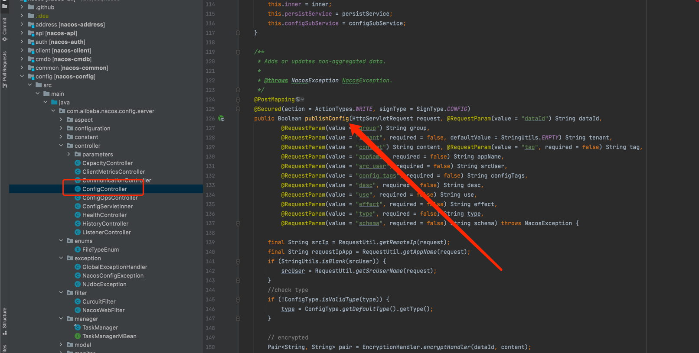
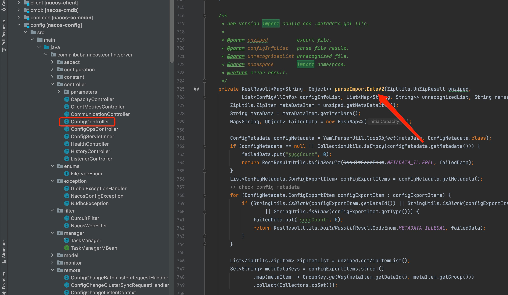
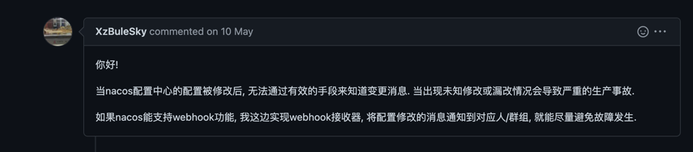
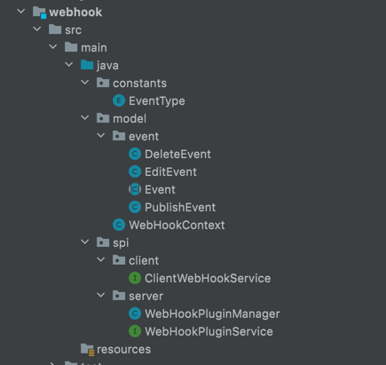
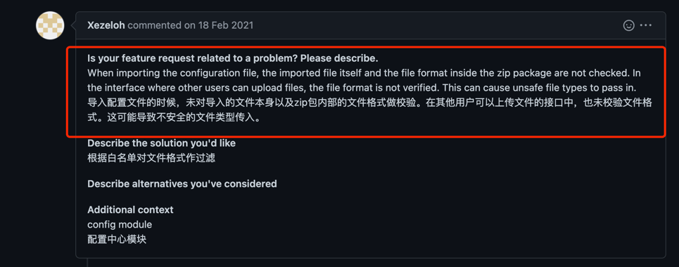
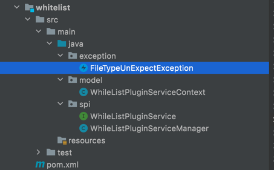
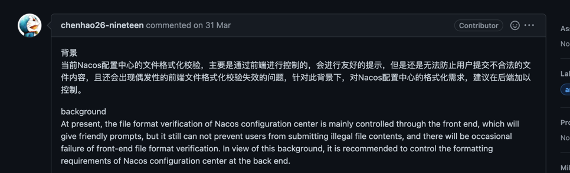
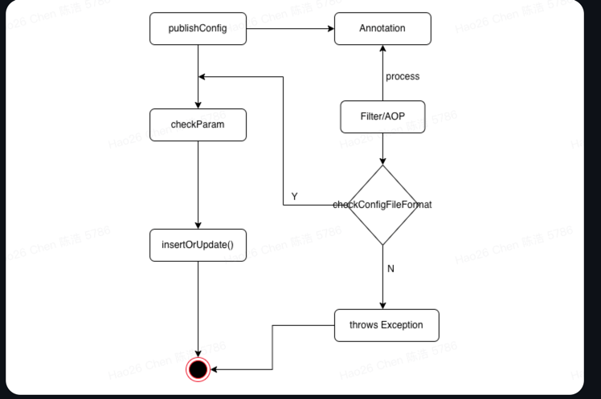
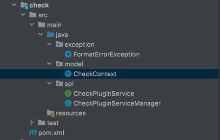

## 一、项目名称
- Nacos - Nacos configuration modify hook plugin copy
## 二、项目详细方案

### 1、插件切入点接口（插件在哪里执行）

- 因为此次插件是针对**发布，修改，删除**应用配置，另外白名单的切入点还有在**导入配置**里需要，在阅读了代码后，选用了以下插件切入点，

1、**ConfigController.publishConfig():** 在这里我们是所有config publish、edit事件的入口



2、**ConfigController.deleteConfig():** 在这里我们是所有config delete的事件的入口


3、**ConfigController.parseImportDataV2() and ConfigController.parseImportData:**



### 2、webhook插件 [github 项目链接](https://github.com/Florence-y/plugin/tree/master/webhook)
#### （1）插件背景
基于nacos [issue#8338](https://github.com/alibaba/nacos/issues/8338) 的描述

可以知道用户是想在自己的服务上暴露一个接受请求的接口，只要config 模块发生 publish、edit、delete事件，用户想感知并做一些特殊操作
。
#### （2）具体代码
#####  1.包架构


- constants: 常量与枚举类
- model：与逻辑相关的一些pojo
- spi：用户可以自定义实现的spi接口

##### 2.主要逻辑代码

```java
// 1、the base event:这个是所有事项基本抽象类，
// 主要用来抽取事件的共性，比如事件的内容（json字符串）
/**
 * base event
 */
public abstract class Event {

    private String content;

    private LocalDateTime time;

    /**
     * the exact type
     * @return
     */
    abstract EventType getEventType();
}

// 2、the event impl:事件的具体实现，也就是说事件可以有发布、编辑、删除
// 包括：DeleteEvent、EditEvent、PublishEvent
/**
 * delete event
 */
public class DeleteEvent extends Event{
    @Override
    public EventType getEventType() {
        return EventType.DELETE;
    }
}
/**
 * edit event
 */
public class EditEvent extends Event{
    @Override
    public EventType getEventType() {
        return EventType.EDIT;
    }
}
/**
 * publish event
 */
public class PublishEvent extends Event{
    @Override
    public EventType getEventType() {
        return EventType.PUBLISH;
    }
}
```

```java
// 3、core spi 代码，client端
// ClientWebHookService:client端可以对服务端对操作，比如添加一个webhook，启用webhook......
/**
 *  client to operate the WebHooks
 */
public interface ClientWebHookService {

    /**
     * client add WebHooks
     *
     * @param name       the webHooks name
     * @param url        the server url that you want to send event,this the unique key
     * @param eventTypes the event your server received edit、publish、delete
     * @return
     */

    Integer addWebHooks(String name, String url, List<EventType> eventTypes);

    /**
     * @param url the webhook unique key
     * @return isSuccess
     */
    boolean enableWebHooks(String url);

    /**
     * @param url the webhook unique key
     * @return isSuccess
     */
    boolean unableWebHooks(String url);

    /**
     *
     * @param url the webhook unique key
     * @return isSuccess
     */
    boolean removeWebHooks(String url);
}
// 4、core spi 代码 server端,
// WebHookContext:执行
/**
 * the context which we offer plugin developer
 */
public class WebHookContext {
    /**
     * the webHook event
     */
    private Event event;
    /**
     * the config change user
     */
    private String trigger;
    /**
     * the config data id
     */
    private String dataId;
    
    // more nacos properties
}
// WebHookPluginService：这里主要包括webHook的具体逻辑。
// send方法决定webHook要发送给谁、如何发送、
// isEnable是否启动、isMatch触发webHook的条件
// 可以根据WebHookContext来做逻辑判断，比如是Event is PublishEvent
// 
/**
 * the WebHookPluginService spi
 */
public interface WebHookPluginService {


    /**
     * webhook send message to server
     *
     * @return
     */
    boolean send(WebHookContext webHookContext);

    /**
     * the webHook is enable
     *
     * @return
     */
    boolean isEnable(WebHookContext webHookContext);

    /**
     * @param webHookContext the context which we offer plugin developer
     *
     * @return
     */
    boolean isMatch(WebHookContext webHookContext);

    /**
     * webhook name(unique key)
     * @return
     */
    boolean getName();
}
```
```java
// 5、CheckPluginServiceManager：这里是管理CheckPluginService的地方，
// config直接调用的地方,隐藏 spi加载细节
/**
 * the WebHookPluginService manager
 */
public class WebHookPluginManager {

    /**
     * the Name to Exact WebHookService
     */
    private final Map<String, WebHookPluginService> webHookPluginServiceMap = new HashMap<>();

    private static final WebHookPluginManager INSTANCE = new WebHookPluginManager();

    public WebHookPluginManager() {
        initWebHookPlugins();
    }
    /**
     * init: load the plugin into webHookPluginServiceMap
     */
    private void initWebHookPlugins() {
        // spi load the WebHookPlugins
    }

    // singleton
    public WebHookPluginManager getInstance() {
        return INSTANCE;
    }

    /**
     * send the webHook to those enable and match Service
     * @param webHookContext
     */
    public void processWebHooks(WebHookContext webHookContext){
        for (WebHookPluginService service : webHookPluginServiceMap.values()) {
            // check enable and match
            if (service.isEnable(webHookContext)&&service.isMatch(webHookContext)){
                // send the webhook to server
                service.send(webHookContext);
            }
        }
    }
}
```


### 3、白名单插件[github 项目链接](https://github.com/Florence-y/plugin/tree/master/whitelist)
#### （1）插件背景
基于 [issue#4912](https://github.com/alibaba/nacos/issues/4912) 的需求讨论


如上图issue讨论结果，因为在导入配置的时候，未对导入的配置文件格式进行校验，所以用户需要一个插件，这个插件有两个操作，首先是校验文件格式是否合法，第二个是
doSomeThing,这里可以是用户的某些自定义行为。
#### （2）具体代码
##### 1.包结构

- exception: 白名单校验异常
- model：与逻辑相关的一些pojo
- spi：用户可以自定义实现的spi接口
##### 2.主要逻辑代码
```java
// 1、业务异常，主要用来校验文件类型不符合预期异常
/**
 * check format error
 */
public class FileTypeUnExpectException extends Exception {
    /**
     * config data id
     */
    String dataId;
    /**
     * feed back message
     */
    String message;
}
// 2、用于枚举服务器允许导入的文件类型
/**
 * all fileType allow
 */
public enum FileType {

    ZIP(".zip"),
    TXT(".txt"),
    MD(".md");
    /**
     * the file suffix 
     */
    private String suffix;

    FileType(String suffix) {
        this.suffix = suffix;
    }

    public String getSuffix() {
        return suffix;
    }
}
// 3、每次导入数据的插件上下文，用户可以根据文件类型是否符合规范，以及后缀是否预期内
// 去做相应的判断与校验
public class WhileListPluginServiceContext {
    /**
     * trigger
     */
    String trigger;
    /**
     * triggerTime
     */
    LocalDateTime time;
    /**
     * fileType
     */
    FileType fileType;


    // more nacos properties
}

// 4、core spi 
// 白名单spi接口，这里主要将白名单抽象成两个动作，一是根据WhileListPluginServiceContext的信息去判断是否可以继续执行，
// 二是process接口可以实现，如果可以继续执行，用户可以执行对应的操作
public interface WhileListPluginService {

    /**
     * check is you can do someThing  such as
     * @param context the context offer developer to do some check
     * @return
     */
    boolean isCanDo(WhileListPluginServiceContext context) throws FileTypeUnExpectException;

    /**
     * execute the exact task
     * @return isSuccess
     */
    boolean process();
}

// 5、WhiteListPluginServiceManager：用于config import时直接调用，
// initWhiteListPluginService载入相应的spi实现
// processWhileListDo，根据插件是否canDo,执行相应的process逻辑
public class WhileListPluginServiceManager {
    /**
     * all the whitelist plugin
     */
    private final List<WhileListPluginService> checkPluginServices = new ArrayList<>();


    private static final WhileListPluginServiceManager INSTANCE = new WhileListPluginServiceManager();

    public WhileListPluginServiceManager() {
        initWhileListPluginService();
    }

    /**
     * init: load the plugin into webHookPluginServiceMap
     */

    private void initWhileListPluginService() {
        // load spi checkPluginServiceImpl into checkPluginServiceList
    }

    /**
     * process whileList
     * @param context
     */
    public void processWhileListDo(WhileListPluginServiceContext context) throws FileTypeUnExpectException {
        for (WhileListPluginService checkPluginService : checkPluginServices) {
            if (checkPluginService.isCanDo(context)){
                checkPluginService.process();
            }
        }
    }

    public static WhileListPluginServiceManager getINSTANCE() {
        return INSTANCE;
    }
}

```
### 2、check插件 [github 项目链接](https://github.com/Florence-y/plugin/tree/master/check)
#### （1）插件背景
基于nacos [issue#8044](https://github.com/alibaba/nacos/issues/8044) 的描述

可以知道现在格式校验是有的，但是是在前端，所以当用户跳过前端，直接请求OpenApi的话，那么就会跳过格式校验，导致异常

校验流程逻辑图如下


#### （2）具体代码
#####  1.包架构

- exception: 白名单校验异常
- model：与逻辑相关的一些pojo
- spi：用户可以自定义实现的spi接口
##### 2.主要逻辑代码
```java
// 1、FormatErrorException格式校验异常，dataId 用于用户排查追踪，message用于提示用户错在哪
/**
 * check format error
 */
public class FormatErrorException extends Exception {
    /**
     * config data id
     */
    String dataId;
    /**
     * feed back message
     */
    String message;
}
// 2、用于校验格式的上下文，主要包括content，content可以为Publish、Edit事件后的内容
/**
 * the context which we offer plugin developer
 */
public class CheckContext {
    /**
     * the config dataId
     */
    String dataId;
    /**
     * the content need to check
     */
    String content;

    // more nacos properties
}

// 3、core spi 
// CheckPluginService:主要的校验接口，check可以根据CheckContext的内容进行上下文校验，
// 如果校验错误抛出FormatErrorException，isEnable作为后续扩展接口，用户可以关闭校验检查
/**
 * the CheckPluginService SPI
 */
public interface CheckPluginService {

    /**
     * the check
     * @param context Context
     * @return isSuccess
     * @throws FormatErrorException if check fail will throw
     */
    boolean check(CheckContext context) throws FormatErrorException;

    /**
     * the check plugin is enable
     * @return
     */
    boolean isEnable();
}

// 4、CheckPluginServiceManager: config controller 直接调用的Manager，
// 主要负责SPI的注入，屏蔽细节，并且采用责任链模式，形成check调用链，可以有多个检验插件
// 

public class CheckPluginServiceManager {

    private static final Logger LOGGER = LoggerFactory.getLogger(CheckPluginServiceManager.class);
    /**
     * all the check plugin
     */
    private final List<CheckPluginService> checkPluginServices = new ArrayList<>();

    private static final CheckPluginServiceManager INSTANCE = new CheckPluginServiceManager();

    public CheckPluginServiceManager() {
        initCheckPluginServices();
    }

    /**
     * init: load the plugin into checkPluginServicesList
     */
    private void initCheckPluginServices() {
        // load CheckPluginService spi
    }

    /**
     * multiply check plugin execute
     * @param context check context
     * @return process is success`
     */
    public boolean processCheck(CheckContext context) {
        // multiply check plugin once one check fail return false
        for (CheckPluginService checkPluginService : checkPluginServices) {
            // isEnable
            if (checkPluginService.isEnable()){
                // do check
                try {
                    boolean isLegal = checkPluginService.check(context);
                    if (!isLegal) {
                        return false;
                    }
                } catch (FormatErrorException e) {
                    LOGGER.warn("CheckPlugin:check fail,data id:{},content:{}",context.getDataId(),context.getContent());
                    return false;
                }
            }
        }
        // check success
        return true;
    }

    public static CheckPluginServiceManager getINSTANCE() {
        return INSTANCE;
    }
}

```


## 三、项目开发时间计划

- 1、2022 年 7 月 4 日 - 2022 年 7 月 24 号 ：设计配置变更的Hook插件接口，实现相关的插件demo，能够在项目上运行。
- 2、2022 7 月 25 号 - 2022 年 8 月 15 号 ：编写相应的单元测试，模拟各种可能出现的情况
- 3、2022年 8 月 16 号 - 2022 年 8 月 27 号 ：提供完善的插件开发文档，包括插件开发，常见场景sample，常见问题等。
## 四、其他你想和导师沟通的点
1、插件的更进一步的设计问题，比如在nacos生产环境下，插件这么设计容不容易扩展，易用

2、相关的如何结合nacos现有的架构去更好的设计插件
