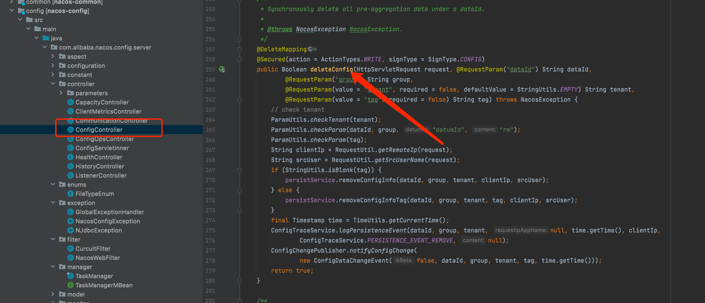

### 一、项目名称
- Nacos - Nacos configuration modify hook plugin copy
### 二、项目详细方案

#### 1、插件切入点接口（插件在哪里执行）

- 因为此次插件是针对发布，修改，删除应用配置，在阅读了代码后，选用了以下两个插入点

1、**ConfigController.publishConfig():** 在这里我们是所有config publish、edit事件的入口


2、**ConfigController.deleteConfig():** 在这里我们是所有config delete的事件的入口



#### 2、webhook插件 [github 项目链接](https://github.com/Florence-y/plugin/tree/master/webhook)
##### （1）插件背景
基于nacos [issue#8338](https://github.com/alibaba/nacos/issues/8338) 的描述

可以知道用户是想在自己的服务上暴露一个接受请求的接口，只要config 模块发生 publish、edit、delete事件，用户想感知并做一些特殊操作
。
##### （2）具体代码
###### 1、包架构


- constants: 常量与枚举类
- model：与逻辑相关的一些pojo
- spi：用户可以自定义实现的spi接口

##### 2、主要逻辑代码

```java
// 1、the base event:这个是所有事项基本抽象类，
// 主要用来抽取事件的共性，比如事件的内容（json字符串）
/**
 * base event
 */
public abstract class Event {

    private String content;

    private LocalDateTime time;

    /**
     * the exact type
     * @return
     */
    abstract EventType getEventType();
}

// 2、the event impl:事件的具体实现，也就是说事件可以有发布、编辑、删除
// 包括：DeleteEvent、EditEvent、PublishEvent
/**
 * delete event
 */
public class DeleteEvent extends Event{
    @Override
    public EventType getEventType() {
        return EventType.DELETE;
    }
}
/**
 * edit event
 */
public class EditEvent extends Event{
    @Override
    public EventType getEventType() {
        return EventType.EDIT;
    }
}
/**
 * publish event
 */
public class PublishEvent extends Event{
    @Override
    public EventType getEventType() {
        return EventType.PUBLISH;
    }
}
```

```java
// 3、core spi 代码，client端
// ClientWebHookService:client端可以对服务端对操作，比如添加一个webhook，启用webhook......
/**
 *  client to operate the WebHooks
 */
public interface ClientWebHookService {

    /**
     * client add WebHooks
     *
     * @param name       the webHooks name
     * @param url        the server url that you want to send event,this the unique key
     * @param eventTypes the event your server received edit、publish、delete
     * @return
     */

    Integer addWebHooks(String name, String url, List<EventType> eventTypes);

    /**
     * @param url the webhook unique key
     * @return isSuccess
     */
    boolean enableWebHooks(String url);

    /**
     * @param url the webhook unique key
     * @return isSuccess
     */
    boolean unableWebHooks(String url);

    /**
     *
     * @param url the webhook unique key
     * @return isSuccess
     */
    boolean removeWebHooks(String url);
}
// 4、core spi 代码 server端,
// WebHookContext:执行
// WebHookPluginService：这里主要包括webHook的具体逻辑，比如webHook要发送给谁、
// isEnable是否启动、isMatch触发webHook的条件，可以根据WebHookContext来做逻辑判断
// 比如是Pub
/**
 * the context which we offer plugin developer
 */
public class WebHookContext {
    /**
     * the webHook event
     */
    private Event event;
    /**
     * the config change user
     */
    private String trigger;
    /**
     * the config data id
     */
    private String dataId;
    
    // more nacos properties
}
/**
 * the WebHookPluginService spi
 */
public interface WebHookPluginService {


    /**
     * webhook send message to server
     *
     * @return
     */
    boolean send(WebHookContext webHookContext);

    /**
     * the webHook is enable
     *
     * @return
     */
    boolean isEnable(WebHookContext webHookContext);

    /**
     * @param webHookContext the context which we offer plugin developer
     *
     * @return
     */
    boolean isMatch(WebHookContext webHookContext);

    /**
     * webhook name(unique key)
     * @return
     */
    boolean getName();
}
```


### 三、项目开发时间计划

1、2022 年 7 月 4 日 - 2022 年 7 月 24 号 ：设计配置变更的Hook插件接口，实现相关的插件demo，能够在项目上运行。
2、2022 7 月 25 号 - 2022 年 8 月 15 号 ：编写相应的单元测试，模拟各种可能出现的情况
3、2022年 8 月 16 号 - 2022 年 8 月 27 号 ：提供完善的插件开发文档，包括插件开发，常见场景sample，常见问题等。
### 四、其他你想和导师沟通的点
1、希望更进一步的了解到开源开发的流程，比如规范的开发流程，dev环境测试、灰度测试等
2、在开源的线上环境下，如果克服无法线下沟通交流的困难
